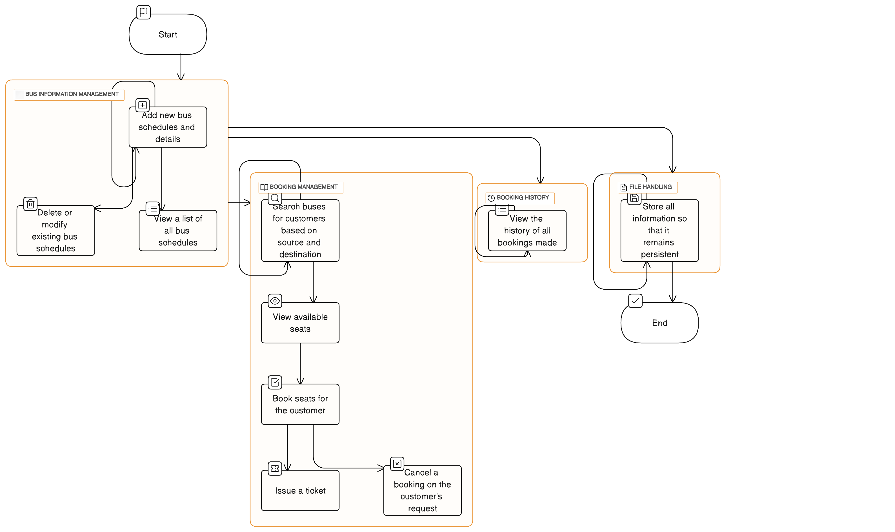

# Simple Bus Reservation and Booking System

Welcome to our Simple Bus Reservation and Booking System! This system helps you book bus tickets and manage bus schedules easily. Even if you're not a computer expert, this guide will walk you through everything you need to know.

## Table of Contents

- [What is this?](#what-is-this)
- [How to Use](#how-to-use)
- [Features](#features)
- [Getting Started](#getting-started)
- [Booking a Bus](#booking-a-bus)
- [Canceling a Booking](#canceling-a-booking)
- [Viewing Booking History](#viewing-booking-history)
- [Tech Stuff (Optional)](#tech-stuff-optional)
- [Screen Shots](#screen-shots)

## What is this?

Our Bus Reservation and Booking System is like an online booking service for buses. It allows you to:

- **Add Bus Schedules**: Imagine it's like creating a new bus route or adding details about an existing one, just like you see on bus company websites.

- **Book a Bus Ticket**: Think of it as reserving a seat on a bus for your journey. You'll receive a ticket just like the ones you get at the counter.

- **View Booking History**: This helps you see all the bus trips you've booked in the past, like a list of your travel records.

## How to Use

Don't worry; you don't need to be a computer whiz to use our system. Just follow these simple steps:

### Getting Started
Git clone the repo and navigate to the ```BusReservationSystemUsingC.c``` file.

1. **Open the Program**: Run the code on a compliler of your choice 
<div align="center">
⚠Make sure you have the following on the same folder as the code⚠
<ul>
	<li>busrecord.txt file</li>
	<li>busbooking.txt file</li>
 	<li>seatingPositions.txt</li>
	<li>booking_ids.txt</li>
</ul>
<i>this is where the file handling of the system is done</i>
</div>

2. **Log In**: Enter the correct username and password to acces the system.
   **Below are the password and username to log in to the system you can modify them on the source code ```BusReservationSystemUsingC.c``` to your liking.**
username
```txt
user
```   
pass
```txt
pass
```
   
### Booking a Bus

1. **Search for Buses**: Select 3 on the main menu and select the bust you want to trav

2. **View Available Seats**: You'll see a list of available seats on the buses that match your search. Think of this as choosing a seat on a plane.

3. **Book a Seat**: Select seats for all the passangers.

4. **Get a Ticket**: You'll receive a ticket with all the details of your journey. Keep it safe, just like a paper ticket.

### Canceling a Booking

If your plans change and you can't make your trip, don't worry:

1. **Open the Program**: Just like before, open the program.

2. **Cancel Booking**: Select 5 on the main menu.

<ul>
	<li>Enter the your booking ID</li>
	<li>Confirm that you want to cancel</li>
</ul>

### Viewing Booking History

1. **Open the Program**: Open the program

2. **Check History**: Select 7 on the main menu.
<ul>
	<li>Ebter the Bus ID number of the bus you want to view history of</li>
	<li>This will display the bus history you cant press any key to cotinue</li>
</ul>

## Features

- **Employee Login**: Employees can log in securely to access the system.
- **Bus Information Management**: Employees can add, edit, or delete bus schedules.
- **Booking Management**: Customers can search for buses, book seats, and receive tickets.
- **Booking History**: Easily view all your past bookings.

## Tech Stuff (Optional)

If you're curious about how it works behind the scenes:

Here is the data flow diagram of the system 
#### Data flow diagram 

#### The flow chart
The flow chart of this system was big and i could not make it smaller to fit here 
If you want to see it you can click [here](https://app.eraser.io/workspace/q4tpddNMJlZafguLfmON) it is hosted online.

⚠The flowchart is not **ReadOnly** so *Please dont modify it*⚠
#### Functions
The current project runs 10 key function namely 
-**Add()**
-**bus()**
-**booking()**
-**status()**
-**cancel()**
-**login()**
-**delete()**
-**printBusDetails()**
-**loadBusData()**
-**displayBusSummary()**

The table below breifly explains what each function does in this project.

| Function             | What it Does                                        |
| -------------------- | --------------------------------------------------- |
| `Add()`              | This function takes inputs from the user about bus details and stores them on busrecord.txt file|
| `bus()`              | Reads busrecord.txt file and display the data as the bus schedules|
| `booking()`          | Handles the booking,updating busrecord,printing tickets |
| `status()`           | Checks the status of a booking on a particular bus       |
| `cancel()`           | Cancel tickets when the user wants |
| `login()`            | Handles user authentication in the system    |
| `delete()`           | Deletes bus schedule|
| `printBusDetails()`  | Prints detailed information in the system |
| `loadBusData()`      | Loads data related to buses in the system      |
| `displayBusSummary()`| Displays a summary of bus/booking history |

#### Structures
I used three key structures in this system  

| Structure                                   | Function                                           |
| ------------------------------------------- | -------------------------------------------------- |
| **`struct Bus`**                            | Represents bus information including unique number, number plate, departure location, destination, timing, journey date, and seating chart. |
|                                             | `int uniqueNumber;` - Holds the unique identifier for the bus. |
|                                             | `char numberPlate[10];` - Stores the bus's number plate. |
|                                             | `char departureLocation[20];` - Represents the departure location. |
|                                             | `char destination[20];` - Represents the destination of the bus. |
|                                             | `char busTiming[10];` - Stores the bus's timing information. |
|                                             | `char journeyDate[12];` - Represents the journey date. |
|                                             | `char busSeatingChart[NUM_ROWS][NUM_COLS];` - Stores the bus's seating chart. |
| **`struct bus1`**                           | Represents bus information including bid, name, locations, timing, and date. |
|                                             | `int bid;` - Holds the bus's unique identifier (ID). |
|                                             | `char noplate[25];` - Stores the bus's number plate. |
|                                             | `char location1[25];` - Represents departure location. |
|                                             | `char location2[25];` - Represents destination location. |
|                                             | `char timing[15];` - Stores the bus's timing information. |
|                                             | `char date[15];` - Represents the date of the bus's operation. |
| **`struct booking1`**                       | Represents booking information including busno, ID, adult counts, children, date, and time. |
|                                             | `int busno, ID;` - Holds the bus number and ID. |
|                                             | `int Maleadult;` - Stores the count of male adults. |
|                                             | `int Femaleadult;` - Stores the count of female adults. |
|                                             | `int children;` - Stores the count of children. |
|                                             | `char date[25];` - Represents the date of the booking. |
|                                             | `char time[25];` - Represents the time of the booking. |

## Screen shots
1. **login scree**
.png)

2. **Main menu**
.png)

3. **Adding bus schedule**
.png)

4. **Bus selection**
.png)

5. **Seat selection**
.png)

6. **Tickets**
.png)

7. **Receipt**
.png)

## **Take note**
###The below consider the below information to run the system smoothly without errors.

---

1. Do not modify the ```busrecode.txt``` file externally because it will hult the normal functioning of the program.
2. You can clear all the ```.txt``` files in order to have accurate data when you start the system,*The existing ones may be inacurate because I used them for **development only***.
3. While adding the bus schedule **do not** insert spaces between records you enter eg in numberplate: KAB123C ✔,  numberplate: KAB 123C ❌.
4. A single booking ID can **only** hold upto **5 passangers** do not exceed 5. 

